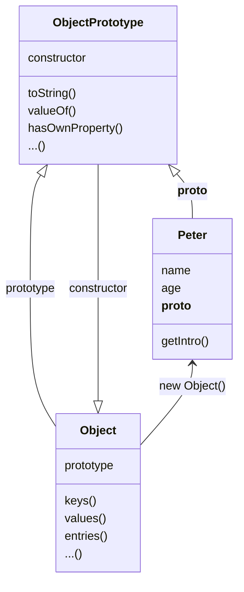
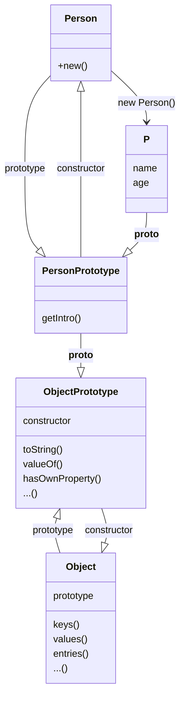
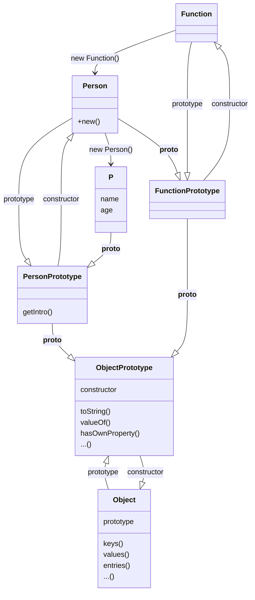
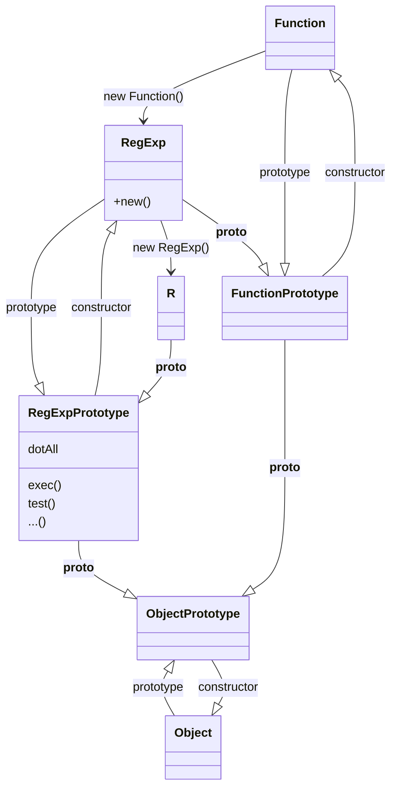
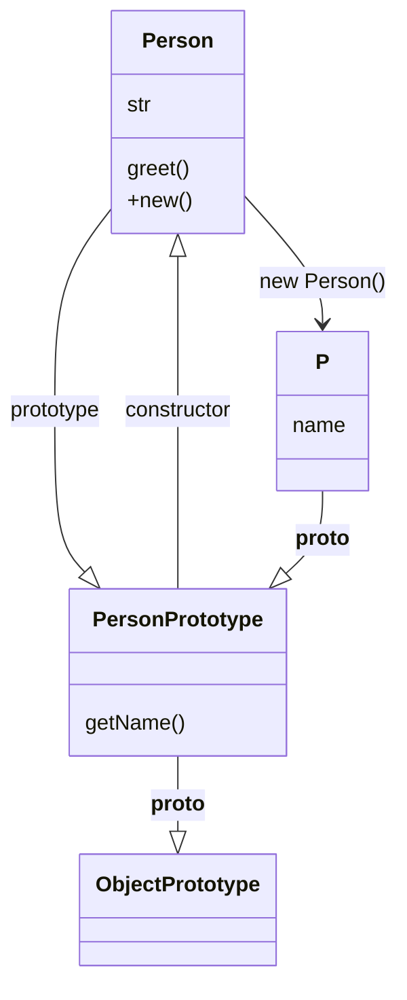
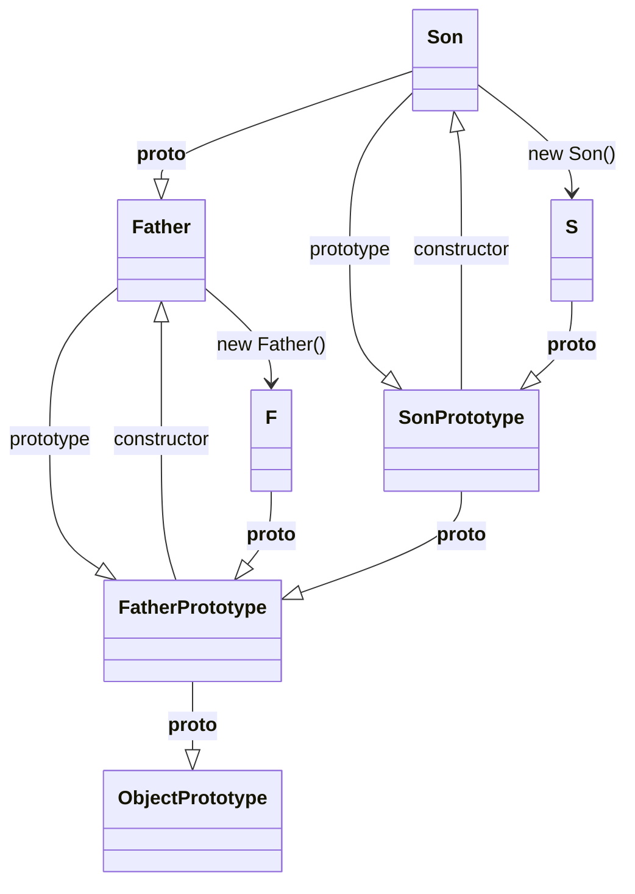
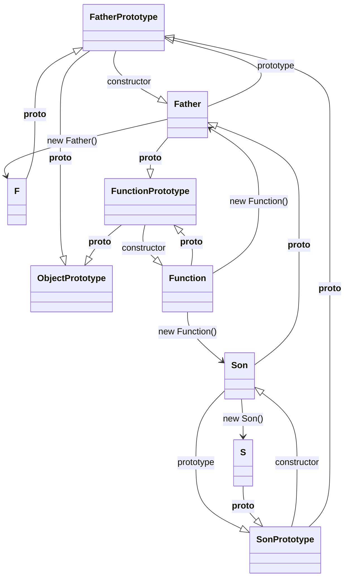

## Get Started

I will write some demo to show how prototype work in Javascript.

## Object

First, All objects in `javascript` are extends from `Object`, So if I declare an object varible:

```js
let Peter = {
  name: "peterroe",
  age: 21,
  getIntro() {
    return `My name is ${this.name}, I am ${this.age} years old`
  }
}
```

The data structure maybe like this:



So you can deduce:

```js
let o = {} // equal: let o = new Object()
Peter.__proto === Object.prototype
Object.prototype.contructor ===  Object
```

The above shows the core of `Javascript Prototype`.

You just to remember: **Once you create an object, which is already in protype chain, you can access Object along the chain.**

## Constructor

Sometimes we declare an Object throught invoke consructor. Such as:

```js
function Persion(name, age) {
  this.name = name
  this.age = age
}
Persion.prototype.getInfo = function() {
  return `My name is ${this.name}, I am ${this.age} years old`
}
let P = new Person('peterroe', 21)
```

Let's see what happend:



But since functions can be declared in the form of `new Function()`, so actually their relationship will more complex:



## Built-in constructor

Some constructors are build in Javascript: `Date, RegExp` or `Symbol, BigInt`, they are all constructors similar to the  above.

let's instantiate `RegExp`, others are the same.

```js
let D = new Date()
let R = new RegExp()
let B = BigInt(2E+80)
let S = Symbol()
```

Built-in constructors are almost equivalent to their own declarations:



## Class

`class` comes from `ES6`, Which help us buit complex relationship easily.

Let consider a complex example to see how `class` work

```js
class Person {
  construcor(name) {
    this.name = name
  }
  static str = "world"        //static property
  static greet() {            //static method
    console.log("Hello" + this.foo)
  }
  getName() {
    return this.name
  }
}
let P = new Person()
Person.str     //=> "world"
Person.greet() //=> "Hello world"
```

Structure:




## Class Extends

`Extends` is also comes from `ES6`, it allows us to build inheritance relationships more easily.

let think a easily demo:

```js
class Father {}

class Son extends Father {}

let F = new Father()
let S = new Son()
```

let's draw what happed above?



And actually, `extend` will destory the relationship of `Function` and `Son`, so Let's draw a most complete diagram



