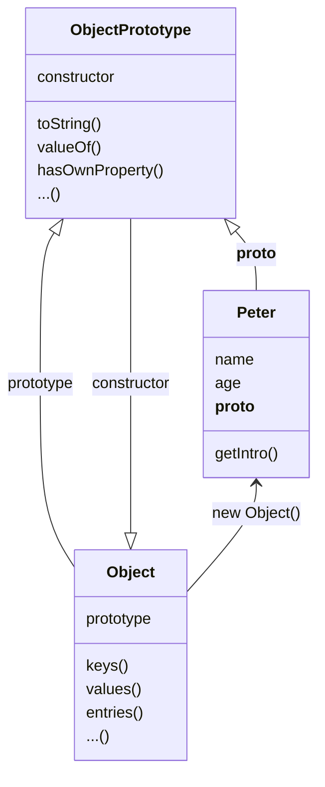

## Get Started

I will write some demo to show how prototype work in Javascript.

## Object

First, All objects in `javascript` are extends from `Object`, So if I declare an object varible:

```js
let Peter = {
  name: "peterroe",
  age: 21,
  getIntro() {
    return `My name is ${this.name}, I am ${this.age} years old`
  }
}
```

The data structure maybe like this:



So you can deduce:

```js
let o = {} // equal: let o = new Object()
Peter.__proto === Object.prototype
Object.prototype.contructor ===  Object
```

The above shows the core of `Javascript Prototype`.

You just to remember: **Once you create an object, which is already in protype chain, you can access Object along the chain.**
